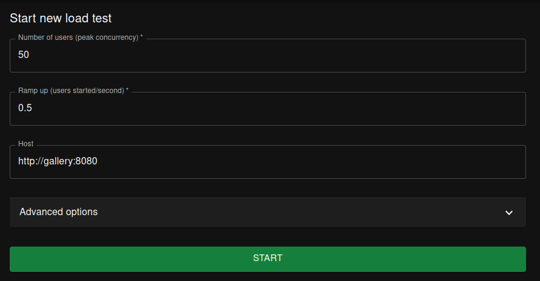
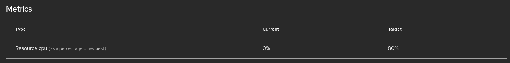
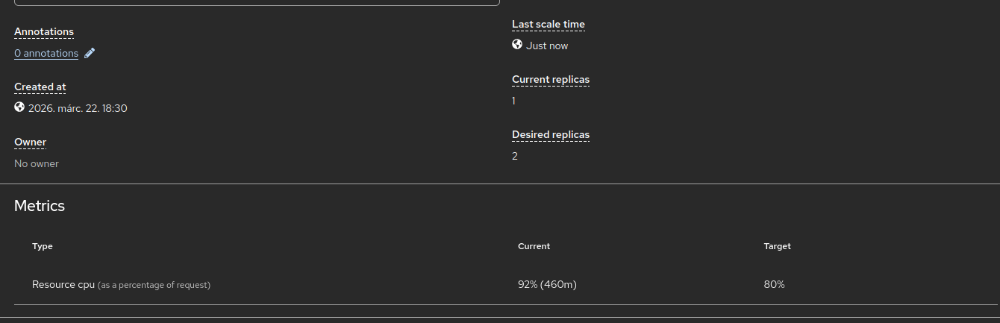
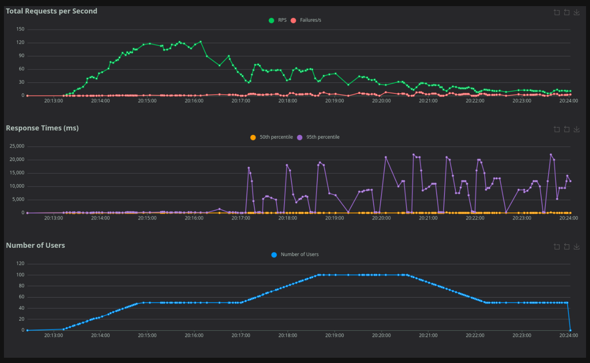
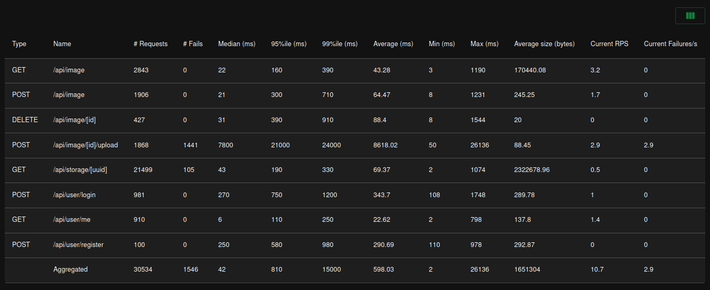
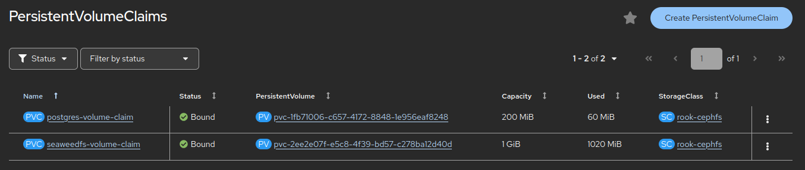
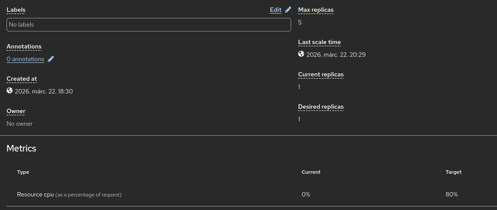

# Load testing

## Locustfile

The locustfile does the following actions:

- register a user
- log in with the user
- get all images, and view 20 randomly selected ones
- upload a new image
- delete uploaded images

The script cleans up all the uploaded images when exiting.

## Building and running

### Locally

When running locally, you only need to install `locust` on your computer, and run 

```bash
locust
```

Then open a web browser on the given URL, and start the tests.

### Kubernetes/OpenShift

First, you need to build a Docker image containing the locustfile and the test images

```bash
docker build -t kisbogdan/gallery-locust:latest .
docker push kisbogdan/gallery-locust:latest
```

Then, you need to deploy it using the given `locust.yaml`

```bash
kubectl apply -f locust.yaml
kubectl port-forward services/locust 8089:8089
```

Or, if running OpenShift

```bash
oc apply -f locust.yaml
oc port-forward services/locust 8089:8089
```

## Load testing

### Autoscaling

The following parts were added to the `deploy.yaml` for autoscaling:

A CPU limit and request for the `gallery` deployment

```yaml
          resources:
            limits:
              cpu: 1000m
            requests:
              cpu: 500m
```

An autoscaler

```yaml
apiVersion: autoscaling/v2
kind: HorizontalPodAutoscaler
metadata:
  name: gallery-autoscaler
  namespace: lab2
spec:
  scaleTargetRef:
    apiVersion: apps/v1
    kind: Deployment
    name: gallery
  minReplicas: 1
  maxReplicas: 5
  metrics:
    - type: Resource
      resource:
        name: cpu
        target:
          averageUtilization: 80
          type: Utilization
```

### Load generation

I started the Locust deployment and started generating load with 50 users with a ramp up of 0.5. There is no service defined for Locust, so I used the port forward function in the command line tool:

```bash
oc port-forward deployments/locust 8089:8089
```



Before starting the test, the autoscaler reported a CPU use of 0%.



About a minute in, the load increased and the desired pod count also grew to 2.



The load levelled of after about 3 minutes (when all the "users" were active), and 3 pods were enough.


At this point, I updated the user count to 100. The CPU usage did not go up





The lots of failed uploads were suspicious, because none of my local tests showed these kinds of results. After a little bit of investigation, I found that the PersistentVolumeClaim of the SeaweedFS filled up, and it was unable to accept any more images.



The other errors contained 104 cases of the image not being found and 1 network error. The 404 error is a result of a race condition, where a user starts downloading some images, while an other user deletes the image which is being loaded. This is expected with this kind of load.

All in all, the autoscaling seems to work well, and after some time, it nicely scaled back to 1 pod.


